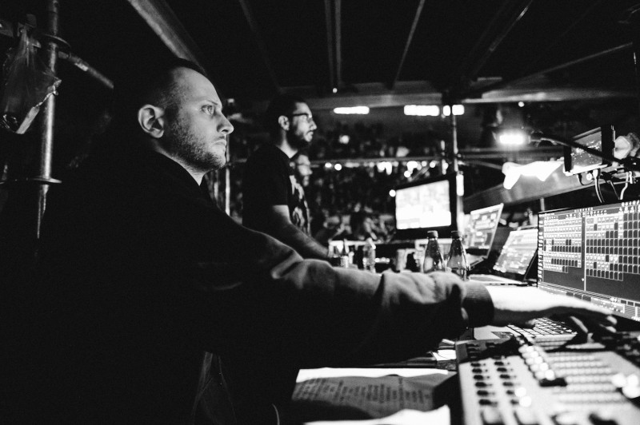

Born in 1995

Bachelor at Faculty of Dramatic Arts in Serbia

Master at Film University Babelsberg in Germany.

Drive for filmmaking since the age of 7. Lot of experimenting and  having fun. Film studies have introduced me to professional environments.

Along the way I self-learned to do animation, music and live visuals.

Software that I use:

- DaVinci Resolve

- Premiere, After Effects, Photoshop

- Cinema 4D

- Touchdesigner

- Unreal Engine 5

- Resolume Arena

- FL Studio

- Ableton Live

Light consoles that I’ve worked on:

- Martin

- Chamsys

- grandMA

- Avolites

